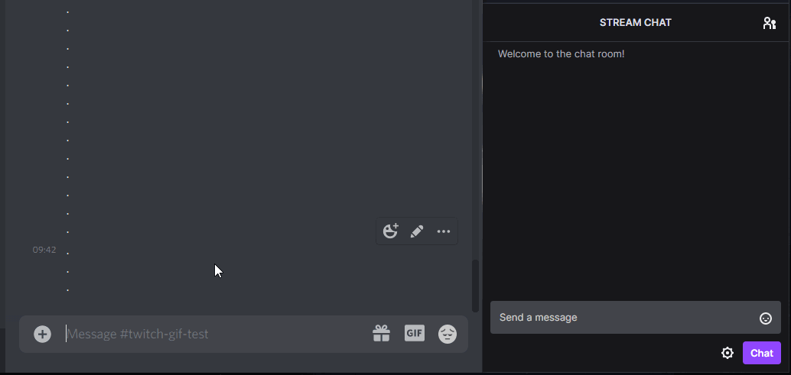
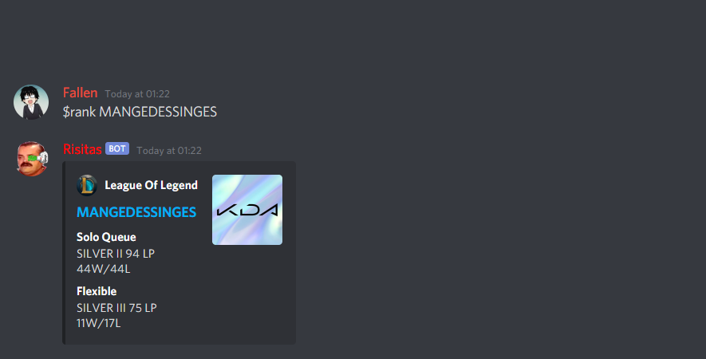
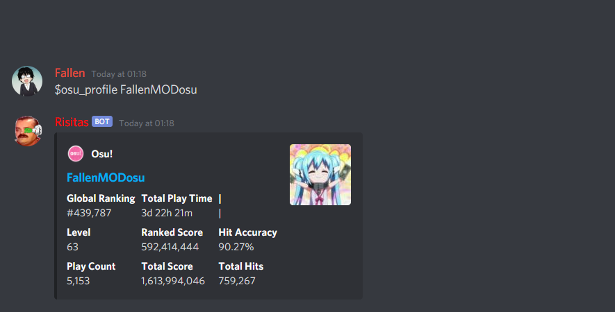
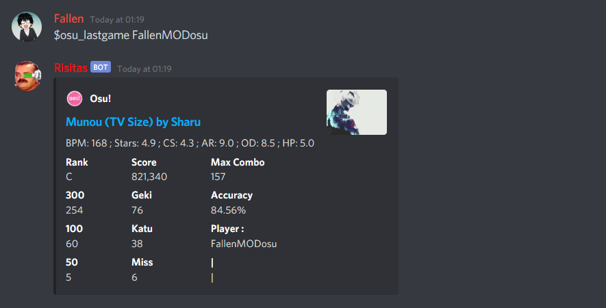
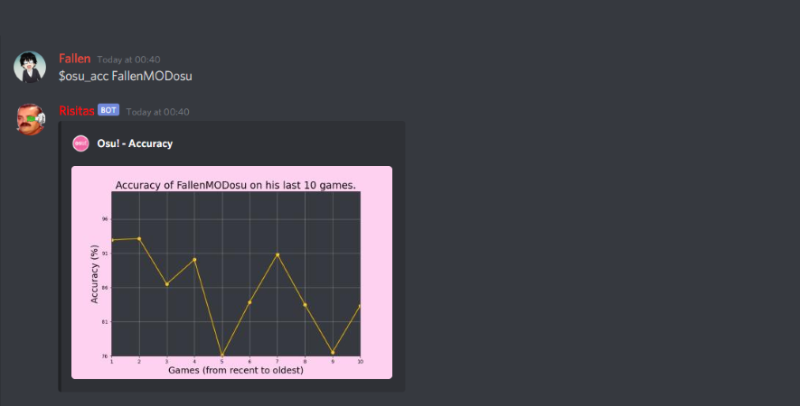

<h1 align="center">🤖 Risitas Discord Bot 🤖</h1>
<p>
  
  <a href="#" target="_blank">
    
  </a>
  
</p>

>Risitas is a Discord bot that can connect your twitch chat to a discord channel in real time, make laugh your friends by playing the "Issou !" meme on command in a voice channel and even give you your League Of Legend rank.

<br>

# 💻 Demo

<br>



<br>



<br>



<br>



<br>



<br>

# 📢 Commands

<br>

### **chat_set**
```
$chat_set {name_of_twitch_channel}
```
This command allows you to start the link between the channel where you use the command and a twitch chat.


### **chat_stop**
```
$chat_stop
```
This command allows you to stop the active twitch chat in the channel.


### **issou**
```
$issou @{discord_member}
```
This command will make the bot shout the "Issou !" meme in a voice channel. By default it will do it in the voice channel where the user is connected but you can tag a user on your server to make the bot join their voice channel.


### **rank**
```
$rank {lol_username}
```
This command will display a message with the current League of Legend rank of the EUW account you ask for. Make sure to use quotes if there is spaces in the LoL username.


### **osu_profile**
```
$osu_profile {osu_username}
```
This command will display a message with all the (basics) stats from the Osu! profile you ask for. Make sure to use quotes if there is spaces in the username.


### **osu_lastgame**
```
$osu_lastgame {osu_username}
```
This command will display a message with all the stats from the last Osu! game the player you asked for played. Make sure to use quotes if there is spaces in the username.


### **osu_acc**
```
$osu_acc {osu_username}
```
This command will display the Accuracy of the player you asked for on his last games (with a maximum of 10 games). 

<br>

# ⚙ Configuration

>**To use this bot you'll have to create a private.py file and enter the different tokens to use the API's by assigning values to those variables**
```
External service tokens :
* TOKEN_BOT
* TOKEN_RIOT
* TOKEN_TWITCH
* TOKEN_OSU
* ID_TWITCH

Socket related var :
* SERVER
* PORT
* NICKNAME
```

<br>

# 👨‍💻 Author

👤 **Florian Sylvain**

* Website: https://andhefallen.site/
* Github: [@Floriansylvain](https://github.com/Floriansylvain)

<br>

## ⭐️ Show your support

Give a ⭐️ if you liked this project!