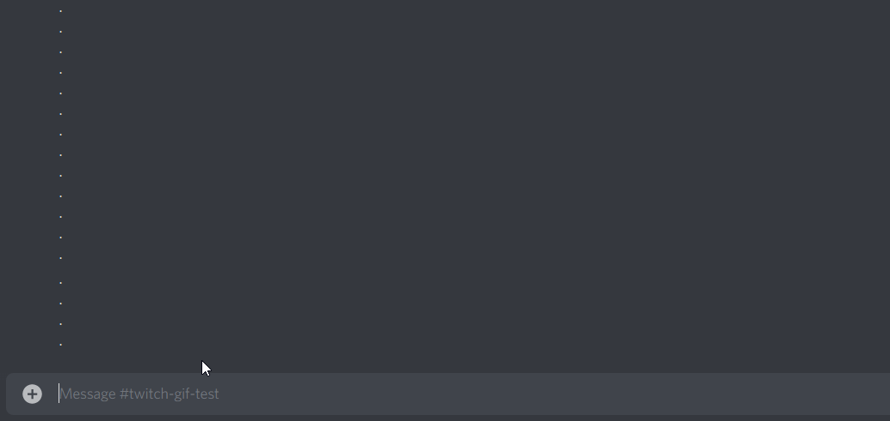

# Risitas_BOT




## Usage

```
$chat_set ...
```

This command allows you to link the channel where you use the command to a twitch channel chat.

```
$chat_stop
```

Use this command to stop the chat active in the channel.

```
$issou (...)
```

By default, $issou will make the bot come in the voice channel where you are and shout "issou !", but if you tag someone with it, it will shout "issou" at the person you tagged ! (if he's connected to any voice channel on the server ofc)

```
$rank ...
```

The $rank command will show you League of Legend ranks of the EUW account you ask for. (please use quotes if there is spaces in the nickname you try to use the command with)

## Tokens and IDs

They are normally in a "private.py" file and named respectively :
* token_bot
* token_riot
* token_twitch
* id_twitch

and same for the sockets related vars :
* server
* port
* nickname

For obvious reasons, I won't upload this file.
